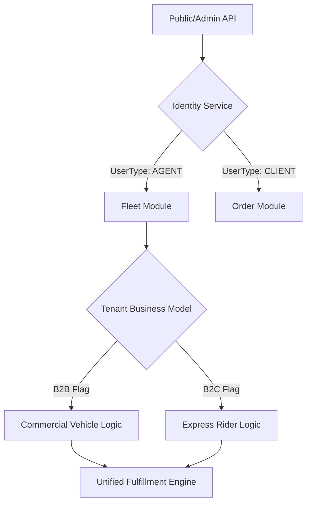

# Architecture Deep Dive: B2B & B2C Role Alignment

This document compares the current **Semantic Separation** approach with the proposed **Unified Logistics Identity (ULI)** model to determine the best path for a large-scale, enterprise-grade platform.

---

## 1. The Core Tension
In logistics, a "Driver" (B2B/Commercial) and a "Rider" (B2C/Express) perform the same fundamental action: **Moving a package from A to B.** However, their constraints (vehicle type, weight, payout) differ.

### Approach A: Semantic Separation (Current Project State)
*   **Enums**: `DRIVER`, `RIDER`, `USER`, `CUSTOMER`.
*   **Logic**: Implicitly split by role names.
*   **Comparison**: 
    *   **Pros**: Clear domain language (Porter uses Riders, Bringg uses Drivers).
    *   **Cons**: Code duplication in assignment engines, geofencing, and tracking.

### Approach B: Unified Logistics Identity (User's Proposed Approach)
*   **Enums**: `AGENT` (or `DRIVER`), `CLIENT`, `ADMIN`.
*   **Filter**: `tenant.business_model` (B2B vs B2C).
*   **Comparison**:
    *   **Pros**: Maximum code reuse (DRY). One `FleetModule` for everything.
    *   **Cons**: Can lead to "If/Else Hell" if B2B and B2C logic starts to diverge significantly.

---

## 2. Comparison Flow: Which is better?

| Feature | Semantic Separation | Unified Roles (ULI) |
| :--- | :--- | :--- |
| **Development Speed** | Slow (Write Rider logic, then copy to Driver) | **Fast** (Write once, configure for both) |
| **Data Integrity** | High (Strict schemas per role) | **Medium** (Schema must be flexible/extensible) |
| **Scalability** | Medium (Harder to maintain 2x codebases) | **High** (One platform core, multiple configurations) |
| **User Experience** | **High** (Portals feel native to the persona) | **High** (If the UI dynamically adjusts to the flag) |

---

## 3. The "Best for Future" Recommendation: The Hybrid ULI Model

For a large-scale platform, the **User's Approach (Unified Roles)** is superior **IF** combined with a **Strategy Design Pattern**.

### The Proposed Flow:
1.  **Unified Entity**: Instead of [Driver](file:///Users/sanjeet_kumar/Documents/SpringBoot/Logistic/LogisticsSystem/logistics-platform/fleet-module/src/main/java/com/logistics/fleet/model/Driver.java#12-58) vs `Rider`, use a single `FleetAgent` entity.
2.  **Tenant Context Flag**: Add `business_model` to the [Tenant](file:///Users/sanjeet_kumar/Documents/SpringBoot/Logistic/LogisticsSystem/logistics-platform/identity-module/src/main/java/com/logistics/tenant/model/Tenant.java#14-49) entity.
3.  **Strategy Injection**: 
    *   The `AssignmentEngine` doesn't check if the user is a `DRIVER` or `RIDER`. 
    *   It checks `tenant.getFulfillmentStrategy()`.
    *   If `B2C`: It uses "Quickest Single Drop" logic.
    *   If `B2B`: It uses "Multi-stop Route Optimization" logic.

### Why this wins:
*   **B2B Client Views**: See "Tenant Users" managing "Commercial Drivers".
*   **B2C Client Views**: See "Customers" requesting "Gig Riders".
*   **Under the hood**: They both use the **exact same code**, the same tracking database, and the same geofencing streaming topologies.

---

## 4. Visualizing the Unified Workflow

> [!IMPORTANT]
> **Conclusion**: Your approach of using generic roles (`USER`, `DRIVER`) with a discriminator flag is the more mature, enterprise-ready path. It prevents the platform from "collapsing" into many specialized modules that are impossible to maintain at 100+ tenants scale.
