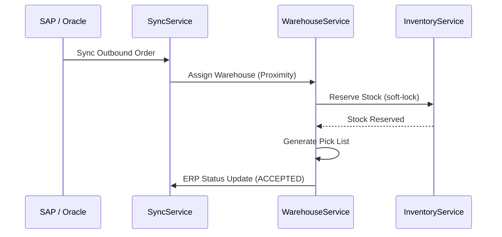

# B2B Inventory Workflow

Multi-warehouse management and enterprise ERP synchronization.

## 1. Feature: Bulk Shipment Fulfillment
Processing large-scale orders from warehouse stock with SLA enforcement.

## 2. Success Flow

## 3. Error Handling & Fallback
| Error Scenario | Detection | Fallback / Mitigation |
| :--- | :--- | :--- |
| **Out of Stock** | `InsufficientQuantity` | **Fallback**: Split order across multiple warehouses or trigger "BACKORDER" flow to ERP. |
| **ERP Auth Failure**| `401 Unauthorized` | Trigger **Circuit Breaker**; Queue sync request in DLQ for manual token refresh. |
| **Pick List Timeout**| `TransactionTimeout` | Rolback stock reservation; Alert warehouse manager via Dashboard. |

## 4. Retry & Completion Logic
*   **Inventory Sync**: Bi-directional sync every 5 minutes. Uses a **Versioned Consistency** check (timestamp-based) to ensure the ERP remains the source of truth.
*   **SLA Retries**: If a shipment violates a pick-time SLA, as automated escalation is sent to the `exception-management-module`.
