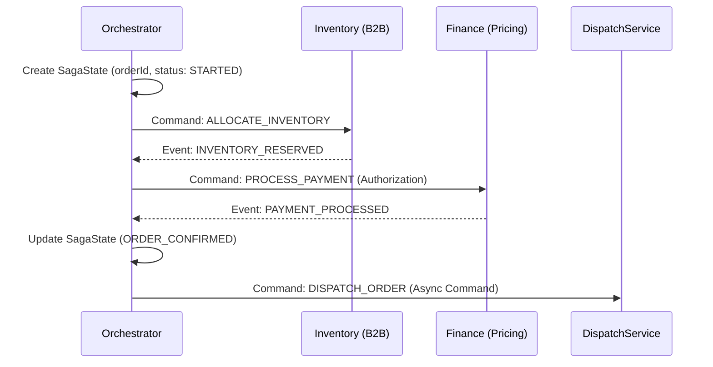
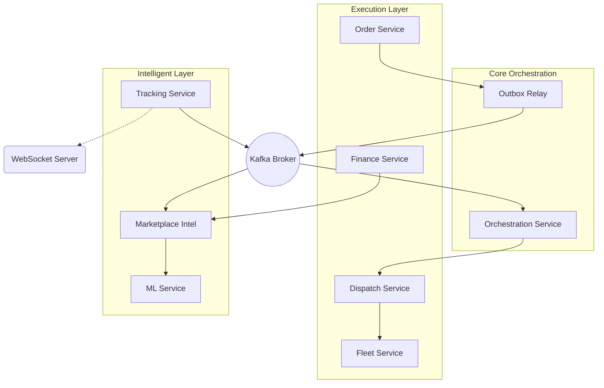

# Logistics Platform: End-to-End Workflow Deep Dive

This document provides a comprehensive technical analysis of the Logistics Platform's core workflows, tailored for senior engineers and architects. It details the orchestration of 40+ microservices using SAGA patterns, real-time streaming, and AI-driven decision loops.

---

## 1. Tenant Onboarding Workflow (Multi-Tenancy Setup)

Onboarding an enterprise tenant (B2B) involves coordinating across Identity, Fleet, Finance, and Platform-Support services.

### Core Workflow Steps
1.  **Identity Module**:
    *   **Action**: Create [Tenant](file:///Users/sanjeet_kumar/Documents/SpringBoot/Logistic/LogisticsSystem/logistics-platform/identity-module/src/main/java/com/logistics/tenant/model/Tenant.java#14-49) entity with unique UUID `tenantId`.
    *   **Data**: Store `SubscriptionTier` (GOLD/SILVER) and [FeatureFlag](file:///Users/sanjeet_kumar/Documents/SpringBoot/Logistic/LogisticsSystem/logistics-platform/identity-module/src/main/java/com/logistics/tenant/model/FeatureFlag.java#14-64) overrides.
    *   **Event**: Emits `OnboardingStartedEvent(tenantId)`.
2.  **Fleet Module**:
    *   **Initialization**: Automatically creates default `Hubs` and `VehicleTypes` for the new tenant.
    *   **Resource Setup**: Maps initial `Fleets` to the registered `Regions`.
3.  **Finance Module**:
    *   **Wallet Setup**: Creates a `PlatformWallet` with 0 balance for commission tracking.
    *   **Stripe Sync**: Creates a remote `Customer` in Stripe via `StripeService`.
4.  **Security Layer**:
    *   **API Keys**: Generates `clientId`/`clientSecret` for the tenant's external integrations.
    *   **Isolation**: Populates the `TenantContext` (based on JWT) for every subsequent request to enforce data boundaries.

---

## 2. B2B Order Lifecycle (Enterprise)

B2B workflows are characterized by bulk ingestion, rigorous SLA enforcement, and ERP synchronization.

### Stage 1: Order Creation & Ingestion
*   **Channels**: API Call, File Upload (CSV/Excel), or EDI translation (standardized via `EdiTranslationService`).
*   **Validation**: `B2BOrderService` validates `SLAConfig` constraints against requested delivery windows.
*   **Handoff**: [OrderCreatedEvent](file:///Users/sanjeet_kumar/Documents/SpringBoot/Logistic/LogisticsSystem/logistics-platform/shared-lib/event-contracts/src/main/java/com/logistics/platform/event/dto/OrderCreatedEvent.java#10-27) is published to the `order.events` topic.

### Stage 2: SAGA Orchestration (Orchestration Service)
The `Orchestrator` consumes the event and initializes a [SagaState](file:///Users/sanjeet_kumar/Documents/SpringBoot/Logistic/LogisticsSystem/logistics-platform/fulfillment-module/src/main/java/com/logistics/orchestration/model/SagaState.java#15-50) in PostgreSQL.

### Stage 3: Dispatch & Tracking
1.  **Dispatch Service**: Receives [DispatchCommand](file:///Users/sanjeet_kumar/Documents/SpringBoot/Logistic/LogisticsSystem/logistics-platform/shared-lib/event-contracts/src/main/java/com/logistics/platform/event/dto/DispatchCommand.java#9-18).
2.  **Search**: Queries `FleetService` for active vehicles. Uses `DispatchScoringEngine` to rank drivers by `distance`, `capacity`, and `SLA_Match`.
3.  **Confirmed**: Emits `DispatchAssignedEvent`.
4.  **Real-Time Monitoring**: `TrackingService` ingests raw GPS via Kafka. ETAs are predicted by `MLService`.
5.  **SLA Watch**: Kafka Streams topology joins location telemetry with `SLA_TARGET_TIME`. If `current_eta > target_time`, it emits `SLABreachPredictedEvent`.

### Stage 4: Exception & Re-Optimization
*   **Detection**: `ExceptionManagementService` detects a `no-show` or `traffic_delay`.
*   **Trigger**: Calls `ReOptimizationService` to find another driver at the same hub.
*   **Proposal**: `ReOptimizationService` proposes a `ReAssignment`. 
*   **Apply**: `Orchestrator` applies the proposal as a new SAGA step, or sends to `Control Tower` for manual approval by an ops manager.

---

## 3. B2C Order Lifecycle (On-Demand)

B2C workflows prioritize extreme low-latency matching and dynamic marketplace intelligence.

### Stage 1: Pricing & Surge
1.  **Quote**: Customer requests price via Mobile App.
2.  **Marketplace Intelligence**: `DynamicPricingEngine` checks `SurgeZone` status. If supply (active drivers) < demand (recent orders in 5 min), a 1.5x multiplier is applied.
3.  **Presentation**: `PriceEstimate` returned with a 2-minute expiration TTL.

### Stage 2: Fast Dispatch & Live Tracking
*   **Matching**: [DispatchService](file:///Users/sanjeet_kumar/Documents/SpringBoot/Logistic/LogisticsSystem/logistics-platform/fulfillment-module/src/main/java/com/logistics/dispatch/service/DispatchService.java#31-250) performs a rapid radial search in Redis for gig-drivers.
*   **Broadcast**: Sends [DispatchCommand](file:///Users/sanjeet_kumar/Documents/SpringBoot/Logistic/LogisticsSystem/logistics-platform/shared-lib/event-contracts/src/main/java/com/logistics/platform/event/dto/DispatchCommand.java#9-18) to the top 5 nearest drivers.
*   **WebSocket Push**: Upon assignment, `TrackingService` pushes position updates to `/topic/tracking/{orderId}`. Customers see the driver moving in real-time.

---

## 4. Cross-Cutting Mechanisms

### A. SAGA & Compensation Logic
If a step fails (e.g., `PAYMENT_FAILED` after `INVENTORY_RESERVED`), the `Orchestrator` executes compensations in reverse:
1.  `CompensateInventoryCommand` -> `InventoryService` releases the soft-locked stock.
2.  [SagaState](file:///Users/sanjeet_kumar/Documents/SpringBoot/Logistic/LogisticsSystem/logistics-platform/fulfillment-module/src/main/java/com/logistics/orchestration/model/SagaState.java#15-50) marked as `COMPENSATED`.

### B. Transactional Outbox Pattern
Ensures reliability between DB updates and Kafka publishing.
1.  **Domain Update**: `orderRepository.save(order)`.
2.  **Outbox Entry**: `outboxRepository.save(new OutboxEvent(ORDER_CREATED, orderPayload))`.
3.  **Relay**: A background task (or CDC) reads the `Outbox` table and publishes to Kafka. Marks as `PUBLISHED` upon ACK.

### C. ML Feedback Loop
*   **Telemetry**: Actual delivery timestamps and driver acceptance scores are aggregated.
*   **Ingestion**: `MarketplaceIntelligenceService` sends outcomes to `intelligence.feedback.v1`.
*   **Format**: JSON carrying `orderId`, `predictedEta`, `actualEta`, `successMetric`.
*   **Result**: ML models are retrained nightly to improve future `Dynamic Pricing` and `Dispatch Scoring`.

---

## 5. Module Interaction Summary

**Key Pitfalls & Trade-offs:**
*   **Eventual Consistency**: There is a sub-second lag between order creation and orchestration start. High-throughput B2C orders must account for this in the UI (optimistic UI updates).
*   **SAGA Complexity**: As steps increase, managing state at scale requires robust [SagaState](file:///Users/sanjeet_kumar/Documents/SpringBoot/Logistic/LogisticsSystem/logistics-platform/fulfillment-module/src/main/java/com/logistics/orchestration/model/SagaState.java#15-50) partitioning in the DB.
