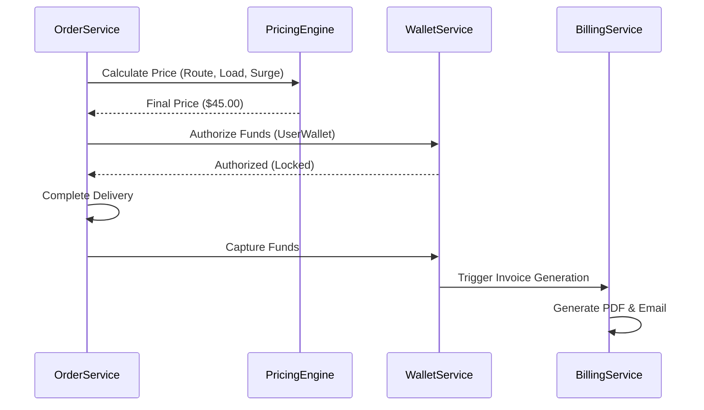

# Finance & Billing Workflow

Managing the flow of money, dynamic pricing, and automated invoicing.

## 1. Feature: Dynamic Pricing & Automated Billing
Calculating the final cost of service and executing the financial transaction.

## 2. Success Flow

## 3. Error Handling & Fallback
| Error Scenario | Detection | Fallback / Mitigation |
| :--- | :--- | :--- |
| **Insufficient Funds** | `BalanceInquiryFailed` | Reject order placement; prompt user to top-up wallet or change payment method. |
| **Pricing Engine Down** | `ExecutionTargetNotFound` | **Fallback**: Use **Standard Rate Card** (Fixed distance + base fare) to avoid blocking orders. |
| **PDF Gen Failure** | `StorageException` | Persist ledger entry; trigger async retry for PDF generation every 10 mins. |

## 4. Retry & Completion Logic
*   **Wallet Transactions**: Uses **Two-Phase Commit** (Soft Lock -> Capture) to prevent double spending. If Capture fails, the lock expires in 2 hours, returning funds to the user.
*   **Payouts**: Driver payouts are processed in batches every 24h. If a gateway failure occurs, the batch is retried with a 1-hour delay.
