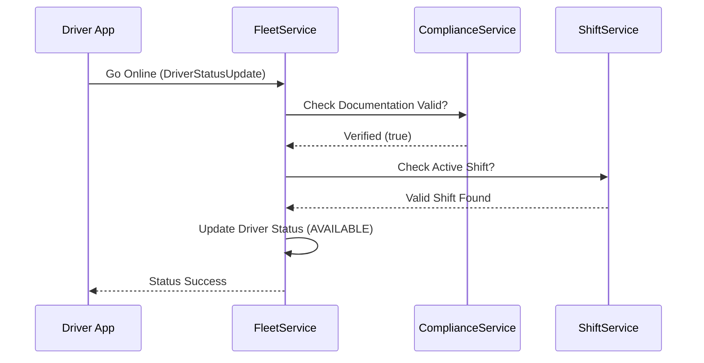

# Fleet Management Workflow

Tracking driver lifecycle, shifts, and real-time compliance.

## 1. Feature: Driver Check-in & Compliance
Ensures drivers are legally cleared and physically available for work.

## 2. Success Flow

## 3. Error Handling & Fallback
| Error Scenario | Detection | Fallback / Mitigation |
| :--- | :--- | :--- |
| **Expired License** | `ComplianceCheckFailed` | Reject check-in; Return `403 Forbidden` with reason "DOC_EXPIRED". |
| **GPS Jitter** | `InvalidCoordinateException` | Filter outlier pings via Kalman Filter (on-device or gateway layer). |
| **Shift Not Found** | `ShiftValidationFailed` | Allow check-in as "ON_DEMAND" (if tenant permit) or reject. |

## 4. Retry & Completion Logic
*   **Location Streaming**: If the TCP/WebSocket connection drops, the app caches GPS points locally and performs a **Bulk Upload** upon reconnection.
*   **Compliance Re-Verification**: Automated background check every 24 hours. If papers expire mid-shift, the driver's current assignment is completed, but no new orders are matched.
