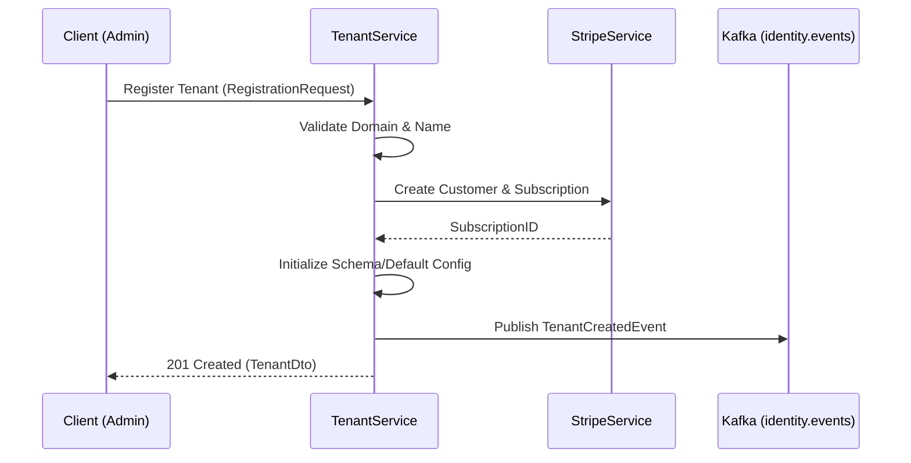

# Identity & Access Workflow

This document details the lifecycle of identity, authentication, and multi-tenancy operations.

## 1. Feature: Tenant Onboarding & Auth
Securely registering a new business entity and providing authenticated access to its users.

## 2. Success Flow

## 3. Error Handling & Fallback
| Error Scenario | Detection | Fallback / Mitigation |
| :--- | :--- | :--- |
| **Duplicate Domain** | `DataIntegrityViolation` | Return `409 Conflict`; UI prompts for new name. |
| **Stripe Timeout** | `StripeException` (Timeout) | **Fallback**: Create tenant in "PENDING_PAYMENT" status. Trigger async retry. |
| **Auth Token Expired** | `ExpiredJwtException` | Client uses `/refresh` endpoint automatically. |

## 4. Retry & Completion Logic
*   **Stripe Integration**: Uses exponential backoff (Resilience4j) with 3 retries. If all fail, the tenant is marked as `INCOMPLETE_ONBOARDING` for manual intervention in the admin portal.
*   **Kafka Events**: If Kafka is down, the event is stored in the `outbox` table. A background job (`EventRelay`) retries every 30 seconds until successful.
