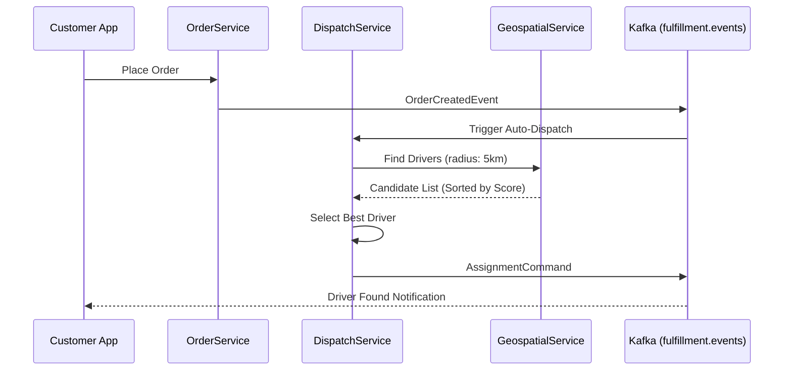

# Order & Fulfillment Workflow

This document details the critical path from order placement to final delivery.

## 1. Feature: Last-Mile Dispatch
Matching an on-demand order with the most optimal driver near the pickup point.

## 2. Success Flow

## 3. Error Handling & Fallback
| Error Scenario | Detection | Fallback / Mitigation |
| :--- | :--- | :--- |
| **No Drivers Found** | Empty Candidate List | **Fallback**: Expand radius to 10km. If still none, trigger "DEFERRED_DISPATCH" (retry in 60s). |
| **Driver Rejected** | `AssignmentRejectedEvent` | Immediately trigger re-dispatch with the next best candidate in the list. |
| **Geo-Service Offline**| `ServiceUnavailable` | Fallback to **Historical Matching** (Assign based on driver's home hub/last known area). |

## 4. Retry & Completion Logic
*   **Dispatch Attempts**: Max 5 attempts per order. After 5 failures, the order is moved to `MANUAL_INTERVENTION` status for support ops.
*   **Idempotency**: Every `DispatchCommand` uses the `orderId` as an idempotency key to prevent double-assignment.
