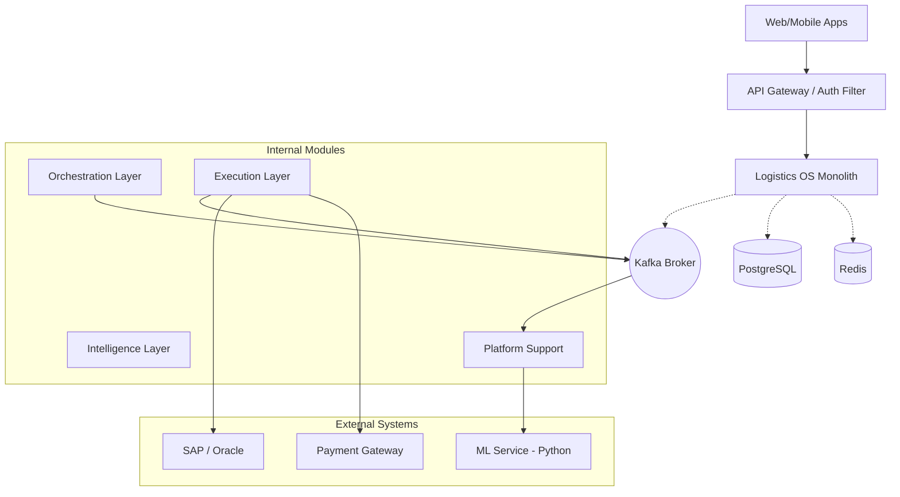

# Logistics OS: Advanced System Design (Entire Platform)

This document provides a deep dive into the advanced system design of the All-In-One Logistics Operating System.

## 1. High-Level Architecture
The platform is built as a **Modular Monolith** with a **Clean Architecture** approach inside each module.

## 2. Advanced Orchestration: Command-Event Pattern
We use a **Choreographed-Orchestration** hybrid to handle complex B2B and B2C flows without tight coupling.

### The "Order to Execution" Flow
1.  **Command**: `orchestration-module` receives a `PlaceOrderCommand`.
2.  **Validation**: Synchronous check against `inventory` and `finance` (Authorisation).
3.  **State Transition**: `Saga` instance created in `orchestration-service`.
4.  **Async Command**: Publish `DispatchCommand` to Kafka.
5.  **Execution**: `dispatch-service` (inside `fulfillment`) processes matching.
6.  **Event**: `driver.assigned` published to Kafka.
7.  **Observer**: `control-tower` updates real-time dashboards; `sla-monitoring` starts ETA tracking.

## 3. Data Model & Consistency
### Schema Isolation
While in a single DB, we use **Schema-per-Module** (or prefix-based isolation) to prepare for future scaling.

#### Core Tables (Simplified)
| Module | Primary Table | Key Relationships |
| :--- | :--- | :--- |
| **Identity** | `tenants` | `users.tenant_id`, `features.tenant_id` |
| **Order** | `orders` (B2C) | `shipments.order_id`, `payments.order_id` |
| **B2B** | `b2b_orders` | `inventory.warehouse_id`, `erp_sync.batch_id` |
| **Fleet** | `drivers` | `vehicles.driver_id`, `locations.driver_id` |
| **Finance**| `wallets` | `transactions.wallet_id`, `invoices.order_id` |

### Transactional Outbox Pattern
To ensure data consistency between DB and Kafka:
1.  Business transaction modifies domain entity.
2.  `Outbox` record is written to the SAME DB transaction.
3.  A relay (Scheduled job or CDC listener) publishes the Outbox record to Kafka.
4.  Ensures **At-Least-Once** delivery.

## 6. Resilience & Operational Safety
The platform uses **Resilience4j** to protect against cascading failures in a modular monolith.

*   **Circuit Breakers**: Applied to all external calls (ML Service, Stripe, SAP/Oracle).
*   **Bulkheading**: Dedicated thread pools for heavy operations like Bulk Uploads or Route Optimization to prevent starving the main API threads.
*   **Rate Limiting**: Enforced at the Tenant level to prevent any single client from overwhelming the system.

## 7. Scaling Strategy (Modular Monolith)
*   **Vertical Scaling**: Initial strategy using optimized VM/Pod resources (8-16 vCPUs).
*   **Horizontal Scaling**: Stateless `logistic-app` pods behind a Load Balancer.
*   **Kafka-based Scaling**: Distribution of heavy background processing (ETA calc, Pricing) across multiple consumer groups dedicated to those specific modules.

## 4. Real-time Layer: Kafka Streams & WebSockets
### Live ETA Deviation Detection
*   **Source**: `fleet.location.raw` (GPS) + `order.lifecycle` (Source/Dest).
*   **Window**: 2-minute sliding window.
*   **Join**: Join telemetry with order metadata.
*   **Logic**: If `CurrentPos` to `Dest` exceeds `PredictedETA` by > 20%, trigger `SLAViolationEvent`.
*   **Push**: `control-tower` consumes violation and pushes alert via WebSockets to Ops dashboard.

## 5. Multi-Tenancy & Isolation
*   **Context**: `TenantContext` stored in `ThreadLocal` via a Servlet Filter.
*   **Persistence**: All queries are intercepted by a Hibernate Filter/Interceptor to automatically append `WHERE tenant_id = ?`.
*   **Message Isolation**: All Kafka headers include `X-Tenant-ID` for consumer-side filtering.
